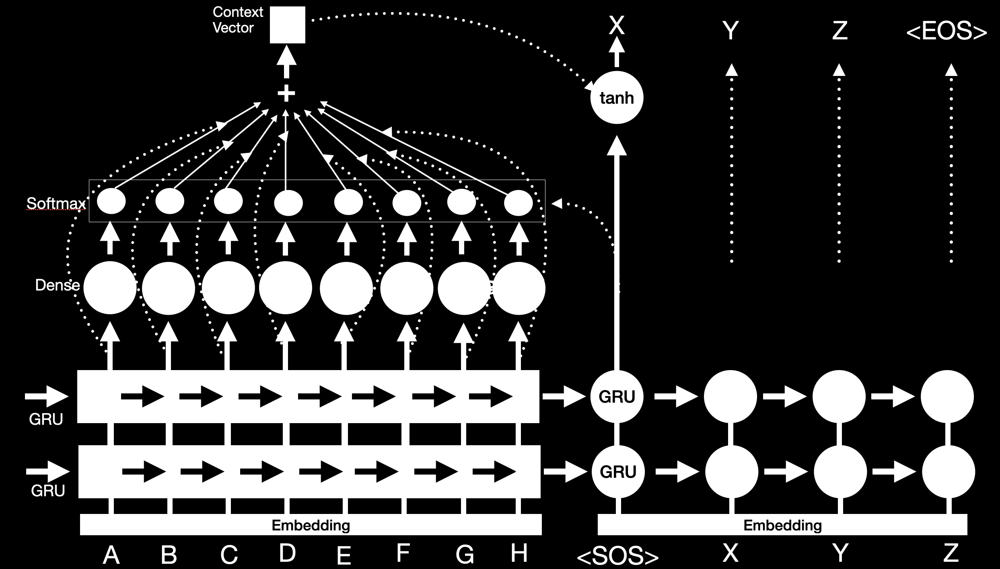
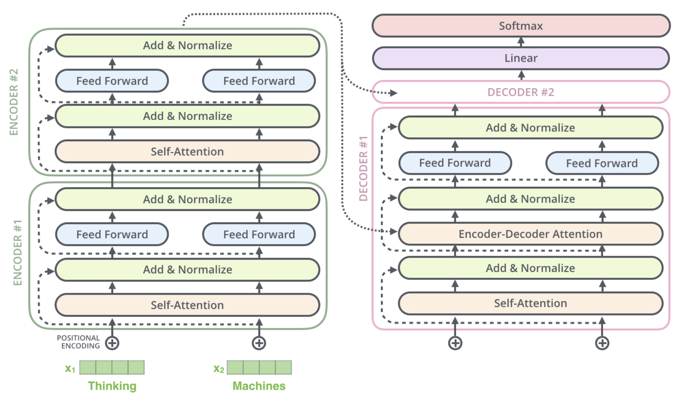

# Machine Translation System
Built Machine Translation System using different approaches

# Goal
- [x] [RNN based model with Luong Attention](rnn_attention.py)
- [x] [Fully Attention based Transformer model](transformers.py)

# Model Architectures
## 1) Neural Machine Translation System using RNN with Attention
Implemented the seq2seq model with Luong attention for building NMTS  
  

## 2) Neural Machine Translation System using Transformer
Implemented the Transformer for building NMTS  
  

# Some cool stuff
- [x] Mixed precision (float16-float32) based training
- [ ] Distributed training support
- [ ] Initial embedding from XLM-R
- [ ] Final layer embedding same as initial embedding

# Running this Project
**1) Clone this project using**:  
`git clone https://github.com/VasudevGupta7/seq2seq.git` 
**Run this script to install all the dependencies**:  
`sh script.sh` 
**2) To train the model, checkout the following command**: 
`python3 train.py --help` 
**3) For distributed training over multiple GPUs, checkout the following command**: 
`python3 distributed_train.py --help` 
**4) To translate english to german checkout the following command**: 
`python3 translate2german.py --help` 

# Papers Implemented
- [Sequence to Sequence Learning with Neural Networks](https://arxiv.org/abs/1409.3215)
- [Effective Approaches to Attention-based Neural Machine Translation](https://arxiv.org/abs/1508.04025)
- [Attention Is All You Need](https://arxiv.org/abs/1706.03762)
