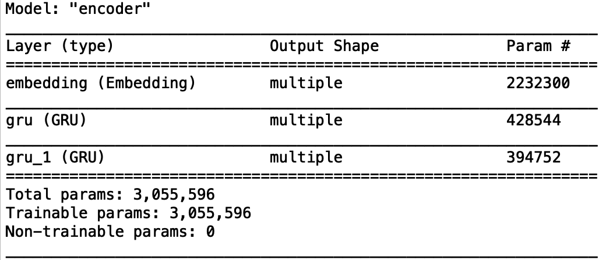
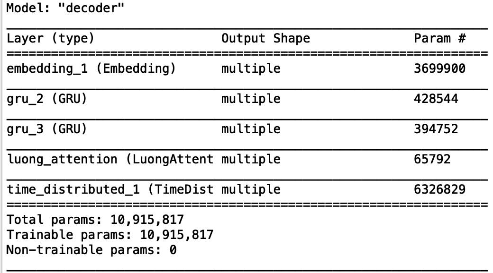

# Neural Machine Translation System with Attention
Implemented the seq2seq model with Luong attention for building NMTS

## Tried to implement model based on following research papers:
- [Sequence to Sequence Learning with Neural Networks](https://arxiv.org/abs/1409.3215)
- [Effective Approaches to Attention-based Neural Machine Translation](https://arxiv.org/abs/1508.04025)

## Model Architecture

## Encoder

## Decoder

## Running this Project
To run this project execute the following command: 
`python3 main.py` 
To translate english to german execute the following command: 
`python3 translate2german.py`
